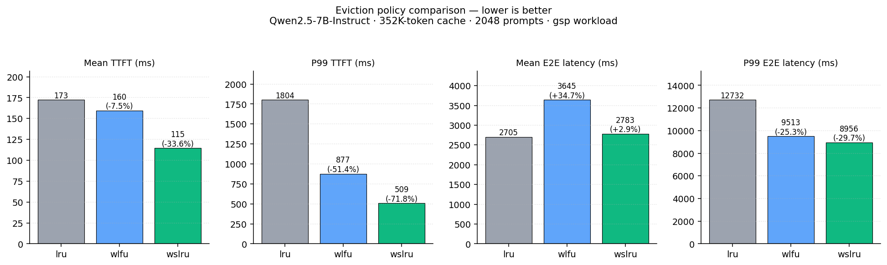

# Eviction eval: wslru_triple

- Run: `2026-04-16T18-57`
- Model: `Qwen/Qwen2.5-7B-Instruct`
- Cache capacity: 352642 tokens
- sglang SHA: `1b781f51c4c5`
- Bench params: `{"num_prompts": 2048, "gsp_num_groups": 128, "gsp_prompts_per_group": 16, "gsp_system_prompt_len": 1024, "gsp_question_len": 64, "gsp_output_len": 64, "request_rate": 16}`
- Baseline (for deltas): **lru**

| Metric | lru | wlfu | wslru | Δ vs lru | Δ vs lru |
|---|---|---|---|---|---|
| Output throughput (tok/s) | 991.42 | 982.89 | 987.55 | -0.9% | -0.4% |
| Request throughput (req/s) | 15.49 | 15.36 | 15.43 | -0.9% | -0.4% |
| Mean TTFT (ms) | 172.55 | 159.58 | 114.57 | -7.5% | -33.6% |
| P99 TTFT (ms) | 1804.17 | 877.28 | 508.86 | -51.4% | -71.8% |
| Mean E2E latency (ms) | 2705.28 | 3645.18 | 2782.81 | +34.7% | +2.9% |
| P99 E2E latency (ms) | 12731.56 | 9513.12 | 8956.07 | -25.3% | -29.7% |
| Cache hit rate (final) | 0.000 | 0.000 | 0.000 | — | — |
| Eviction count | 579 | 550 | 573 | -5.0% | -1.0% |

## What the metrics mean

Lower is better for all latency metrics; higher is better for throughput.

- **Output throughput (tok/s)** — generated tokens per second across the run. Higher is better.
- **Request throughput (req/s)** — completed requests per second. Higher is better.
- **Mean TTFT (ms)** — average Time-To-First-Token: latency from request arrival to the first generated token. Dominated by prefill cost, so a better eviction policy (more prefix-cache hits) directly shrinks this. Lower is better.
- **P99 TTFT (ms)** — 99th-percentile TTFT; the tail user experience. Lower is better.
- **Mean / P99 E2E latency (ms)** — full request latency, prefill + decode. Lower is better.
- **Cache hit rate (final)** — sampled at server shutdown when traffic is idle, so it reads 0.000 here; real hits are visible as `#cached-token` in prefill logs during the run.
- **Eviction count** — number of radix-cache eviction operations during the run. Not better or worse on its own; useful as a sanity check that the cache was under pressure (0 would mean the eviction policy never fired and numbers are noise).

Δ columns are the percentage change vs the baseline policy (`lru`). Negative Δ on a latency metric = improvement.
